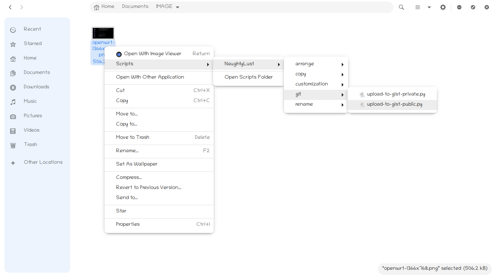

<h1 align=center> NaughtyLust </h2>

Some very helpful nautilus scripts made with &#x2765;

  
  
  
  </img>                                                           

## Features

1. Exception Handled
2. Notification Enabled
3. Easy Installation

## Scripts Categories
### Application
1. **open-with-vscode** : Open directories/files in VScode :)

### Arrange
1. **arrange-by-file-extensions**: Aggregate files based on their extensions in separate directories
2. **arrange-by-file-types**: Aggregate files based on their types in separate directories
3. **arrange-by-names**: Aggregate files based on their first characters in separate directories

### Copy
1. **copy-paths**: Copy file(s)/Dirs absolute path(s) to the clipboard
2. **copy-URIs**: Copy files(s)/Dirs URI path(s) to the clipboard
3. **copy-text-content**: Copy content of a text file to the clipboard

### Customization
1. **est-as-lockscreen**: Set an image as lockscreen (Gnome)
2. **set-terminal-color-scheme**: Generate color pallettes from an image and set as terminal color scheme

### Git
1. **upload-to-gist-private**: Upload text/code file(s) to your GitHub Gist as private
2. **upload-to-gist-public**: Upload text/code file(s) to Gist as public

> NOTE: You have to manually edit these files to set your github username and password/access_token 

### Rename
**Rename file(s) or dir(s) in bulk**

1. **dash-to-space**: Change every *dashes* to *(space)*
2. **dash-to-underscore**: Change every *dashes* to *_(underscores)*
3. **space-to-dash**: Change every *spaces* to *-(dash)*
4. **space-to-underscore**: Change every *spaces* to *_(underscores)*
5. **underscore-to-dash**: Change every *_(underscores)* to *-(dash)*
6. **underscore-to-space**: Change every *_(underscores)*  to *(space)*

## Screenshot

## Prerequisites
In order to run the scripts you should have installed **python3** under /usr/bin/python3

## Installing
Run the `install.sh` script to get it installed it on your system

## Contributing

All kinds of contributions are welcome :raised_hands:! The most basic way to show your support is to star :star2: the project, or to raise issues :speech_balloon: You can also support this project by [**becoming a sponsor on GitHub**](https://github.com/sponsors/deep5050) :clap: or by making a [Paypal](https://paypal.me/deep5050) donation :)

## Versioning
See the [changelog](CHANGELOG.md) file

## Maintainer
[Dipankar pal](@deep5050)

## License
>MIT Dipankar Pal 2020

See the [LICENSE](LICENSE) file for more details.

